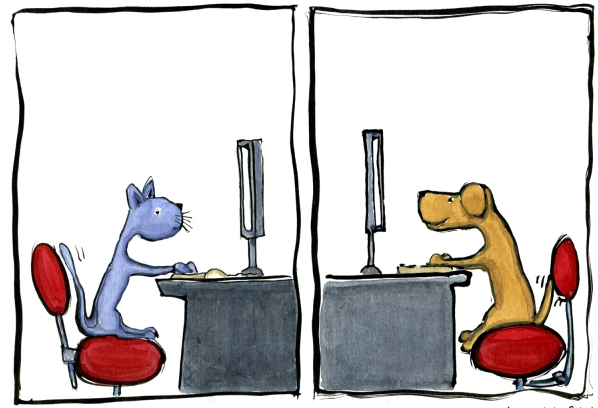

# Chat "Talk"

## Description

The Chat "Talk" project allows users to engage in real-time conversations. It
provides a seamless and interactive chatting experience, allowing individuals to
connect and communicate with ease.

## Features

**Real-time messaging:** Users can send and receive messages in real-time,
creating a dynamic and engaging conversation environment.

**User authentication:** The application incorporates user authentication to
ensure secure access and protect user privacy.

**Create your channels:** Users can create own channels and manage them.

## Technologies

**React:** The application is built using React, a popular JavaScript library
for building user interfaces.

**Python:** The backend is developed using Python, a versatile and powerful
programming language. Python is widely used for server-side scripting, backend
development, and data processing tasks.

## Front-end:

- [github pages](https://oleh-kliapko.github.io/chat-talk-front)
- [repository](https://github.com/Oleh-Kliapko/chat-talk-front)

## Back-end:

- [repository](https://)
- [deploy server](https://)
- [swagger docs](https://)

## Acknowledgements

We would like to express our gratitude to the open-source community for their
valuable contributions and support in building the Chat "Talk" application.
